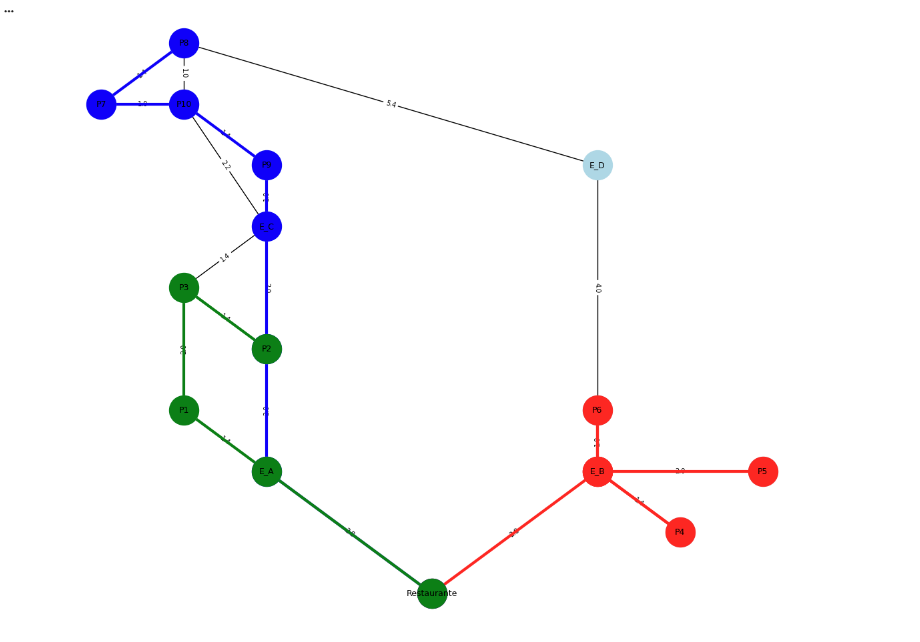

# 🤖 Rota Inteligente: Otimização de Entregas com Algoritmos de IA

## 1. 🎯 Desafio e Objetivos

Este projeto foi desenvolvido para a disciplina de "Artificial Intelligence Fundamentals" da UniFECAF.

O desafio proposto foi resolver um problema de logística para a empresa fictícia "Sabor Express", que sofria com entregas ineficientes, atrasadas e com alto custo de combustível por depender de rotas manuais.

**Meu objetivo principal** foi desenvolver uma solução de IA para otimizar todo o processo de entrega, agrupando pedidos e sugerindo as rotas mais eficientes.

---

## 2. 💡 Minha Abordagem da Solução

Para resolver o desafio, dividi o problema em duas etapas principais, combinando aprendizado não supervisionado e algoritmos de busca em grafos:

1.  **Agrupamento de Pedidos (Clustering):** Primeiro, implementei uma solução para analisar todos os pedidos pendentes e agrupá-los automaticamente em "zonas" geográficas. Escolhi essa abordagem para garantir que cada entregador ficasse responsável por uma área compacta, evitando deslocamentos desnecessários.

2.  **Otimização de Rota (Pathfinding):** Após definir as zonas, tratei cada zona como um problema de otimização de rota individual. Para cada entregador, desenvolvi um script que encontra o caminho mais curto (menor custo) partindo do restaurante e visitando todos os pedidos daquela zona específica.

---

## 3. 🛠️ Algoritmos que Utilizei

### a) K-Means (Para Agrupamento)

* **Por que usei:** Escolhi o K-Means por sua eficiência em dividir um conjunto de pontos de dados (as coordenadas de entrega) em um número 'K' de grupos (os 3 entregadores/zonas).
* **No projeto:** Utilizei a biblioteca `scikit-learn` para implementar o K-Means. Meu script lê as coordenadas dos 10 pedidos e atribui cada um a uma zona (Zona 0, 1 ou 2), como mostrado nos resultados.

### b) Algoritmo $A^{\*}$ (A-Star) (Para Rota)

* **Por que usei:** Escolhi o $A^{\*}$ porque ele é extremamente eficiente para encontrar caminhos em mapas (grafos). Ele é mais inteligente que o BFS ou DFS neste cenário, pois usa uma "heurística" (no meu caso, a distância em linha reta) para "adivinhar" o melhor caminho e chegar à solução ótima mais rápido.
* **No projeto:** Utilizei a biblioteca `networkx` para:
    1.  Modelar o mapa da cidade como um **Grafo**. Os nós são os locais (Restaurante, esquinas, pedidos) e as arestas são as ruas, onde armazenei a distância como "peso".
    2.  Calcular a rota mais eficiente (com menor `peso` total) para cada zona. Meu script executa o $A^{\*}$ em loop para cada entregador, partindo do `Restaurante` e encontrando o caminho ótimo entre os pedidos do seu grupo.

---

## 4. 📊 Diagrama da Solução (Resultado)

A imagem abaixo é o resultado final gerado pelo meu script. Ela demonstra a solução completa em ação: o mapa da cidade modelado como um grafo, com as **3 zonas** (vermelha, verde e azul) calculadas pelo K-Means e as rotas otimizadas para cada uma traçadas pelo $A^{\*}$.



---

## 5. 🚀 Como Executar o Projeto

1.  **Clonar o repositório:**
    ```bash
    git clone [https://github.com/gabrielfreitascariedadesilva-dotcom/projeto-sabor-express.git](https://github.com/gabrielfreitascariedadesilva-dotcom/projeto-sabor-express.git)
    ```

2.  **Navegar para a pasta:**
    ```bash
    cd projeto-sabor-express
    ```

3.  **Instalar as bibliotecas necessárias:**
    *O projeto utiliza Python 3 e as seguintes bibliotecas:*
    ```bash
    pip install numpy scikit-learn networkx matplotlib
    ```

4.  **Executar a solução:**
    ```bash
    # Se você subiu o arquivo .py
    python Untitled2.ipynb

    # Se você subiu o .ipynb, abra-o no Jupyter ou Google Colab
    # e execute todas as células.
    ```

---

## 6. 📈 Análise dos Resultados e Limitações

### Resultados Obtidos
A solução que implementei foi capaz de, com sucesso:
* Agrupar **10 pedidos** em **3 zonas** de entrega usando K-Means.
* Calcular uma rota otimizada e individual para cada zona usando o algoritmo $A^{\*}$.
* Gerar uma prova visual de que o conceito funciona, mostrando as rotas e os custos de cada uma.

### Limitações Encontradas
Como esta é uma solução conceitual, identifiquei algumas limitações para um cenário real:
* **Grafo Estático:** O mapa que criei é fixo e não considera fatores dinâmicos como trânsito, acidentes ou ruas fechadas.
* **Problema do Caixeiro-Viajante (TSP):** A otimização da *ordem* de visita dos pedidos foi feita de forma simples (indo ao mais próximo). Para um número muito grande de pedidos, um algoritmo específico de TSP (Traveling Salesperson Problem) seria mais eficiente.

### Sugestões de Melhoria
Para uma versão futura, identifiquei que a solução poderia ser melhorada com:
* **Integração com APIs:** Usar a API do Google Maps ou Waze para obter distâncias e trânsito em tempo real.
* **Otimização de Ordem (TSP):** Implementar um algoritmo heurístico (como um Algoritmo Genético) para resolver a ordem de visita dos pedidos de forma mais robusta.
* **Interface Gráfica:** Criar uma interface web simples para o dono do "Sabor Express" poder interagir com o mapa e gerar as rotas.
